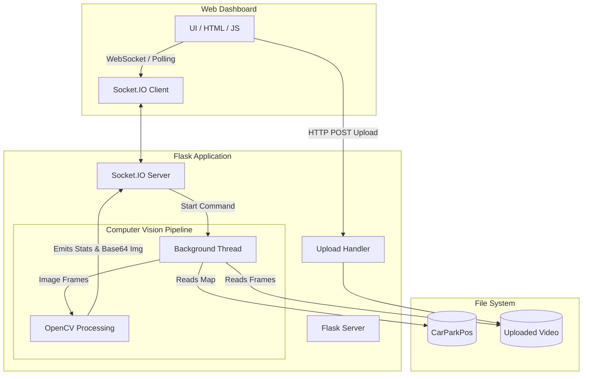

# System Architecture

The Smart Car Parking Detection System consists of a decoupling between a Computer Vision backend pipeline and a real-time web dashboard.

## 🏗️ High-Level Architecture

---

## 🔍 The Computer Vision Pipeline

The core logic of the application revolves around analyzing video frames. Here is the step-by-step pipeline executed on every single frame:

1. **Grayscale Conversion**: The frame is converted to grayscale to reduce complexity.
2. **Gaussian Blur**: A `(3,3)` kernel blur is applied to reduce noise and artifacts.
3. **Adaptive Thresholding**: Converts the image to purely binary (black and white) by evaluating neighborhood pixels, helping combat uneven lighting and shadows across the parking lot.
4. **Median Blur**: Further removes salt-and-pepper noise generated by thresholding.
5. **Dilation**: Thickens the remaining white pixels (edges/objects) making cars a solid block of white pixels.
6. **Space Evaluation**: 
   - The application loops over coordinate boxes imported from `CarParkPos`.
   - It crops the specific region for each space from the dilated image.
   - It counts the non-zero (white) pixels. 
   - *If the pixel count is below a specific threshold (e.g., 900), the space is classified as "Free" (Empty).* Otherwise, it's classified as "Occupied" (Car is present).

## ⚡ WebSockets & Real-Time Streaming

Instead of writing processed video files to disk, the backend leverages **Eventlet** and **Flask-SocketIO** to stream data directly into the browser memory. 
- Processed frames with bounding boxes drawn over them are encoded using highly compressed `.jpg` byte arrays.
- These byte arrays are converted into `Base64` strings.
- A background thread constantly loops, processes the frame, and triggers a Socket.IO broadcast `detection_result` emitting the Base64 image and space metrics (`free_spaces`, `occupied_spaces`) at ~10 FPS.
- The Javascript frontend immediately overrides the `` src tag with the new Base64 string, simulating a smooth, low-latency video feed.
